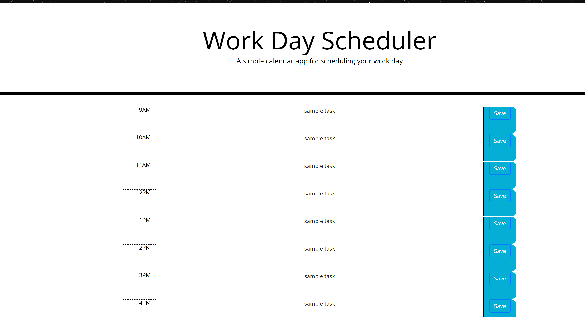

# WORK DAY PLANNER
## Contributions by
- Katharine C Humble

## Technologies Used:
- HTML, Javascript, CSS, Jquery, Bootstrap, Moment.js

## Description
An app that allows users to add items to their work schedule in order to keep track of meetings, events, tasks etc.  By clicking on the center field in the row, the user may add an item schedule for that time slot.  By clicking save in the right column, the user may save the item to local storage, allowing the item to reappear when the screen is refreshed.  By utilizing Moment.JS, the app should change the color of the event field to show the current hour plus future and past.

## Link to app:
https://katharinechumble.github.io/day-planner/

